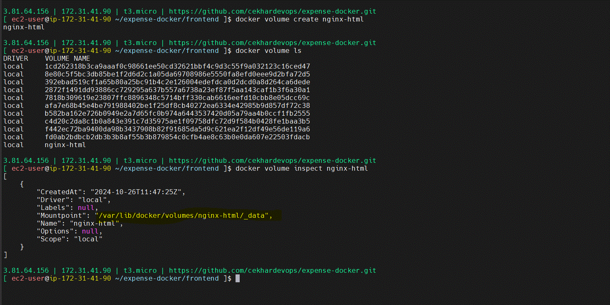
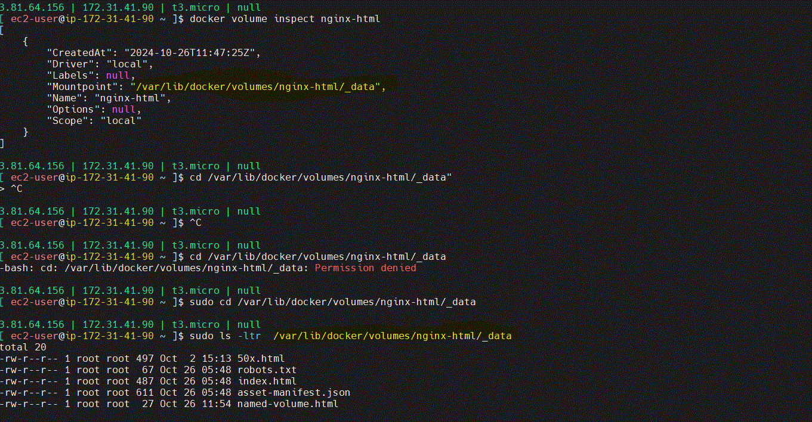

# Docker Network:


1. host
2. bridge --> default
3. overlay --> between multiple docker hosts

***host and bridge networking are two options to determine how containers communciate with host machine and each other***

# 1. Bridge Network:


* **Isolate Network:** containers on bridge network can communicate with each other (like backend connects with mysql) but they isolated from host's network interface

* **Ip Addressing:** Docker assigns each `coantiners its own IP Address within the bridge network's subnet`, enabling communication between containers using these IPs

* **Port Mapping:** To access the container from outside, we need to map container's port to a host port using -P, eg., -p 8080:80 where 8080 is host port and 80 is container port

**Bridge Network suitable for containers that need to communicate with each other within containers cluster/subnet or require isolated network form host network.**

# bridge network usecase

***expesene project has 3 containers frontend, backend, mysql. containers cannot communicate each other in default bridge network.***

so, for that purpose, expense network is created and  then attach each conatiner to expense project

***commands to create bridge network expense and connect mysql container to that network and similarly for backend and frontend containers***

docker network --help
docker network create expense
docker network ls
ifconfig
docker network connect expense mysql
docker inspect mysql
docker network disconnect bridge mysql
docker inspect
docker inspect mysql
docker network connect expense mysql

docker run -d `--network expense` --name backend backend:v1

docker run -d -p 80:80 --name frontend `--network expense` frontend:v1

Here expense is bridge network


every VM get internet access from AWS ISP and assign IP address to our VM.
Docker creates one virutal network inside VM.
docker0: is a virtual n/w interface 172.17.0.1. It acts as modem to the containers inside the vm.

docker0 will provide the IP address to the containers on that host.

docker0 is a bridge network. it is responsible for providing IP address to each container under that network.

docker inspect <container-name> will give us information about container where assigned IP address we can see.

```
]$ ifconfig

docker created virtual n/w interface

docker0: flags=4163<UP,BROADCAST,RUNNING,MULTICAST>  mtu 1500
        inet 172.17.0.1  netmask 255.255.0.0  broadcast 172.17.255.255
        inet6 fe80::42:fcff:fed6:1e16  prefixlen 64  scopeid 0x20<link>
        ether 02:42:fc:d6:1e:16  txqueuelen 0  (Ethernet)
        RX packets 0  bytes 0 (0.0 B)
        RX errors 0  dropped 0  overruns 0  frame 0
        TX packets 5  bytes 526 (526.0 B)
        TX errors 0  dropped 0 overruns 0  carrier 0  collisions 0


aws created n/w interface

ens5: flags=4163<UP,BROADCAST,RUNNING,MULTICAST>  mtu 9001
        inet 172.31.41.90  netmask 255.255.240.0  broadcast 172.31.47.255
        inet6 fe80::c18:b5ff:fe7d:bf15  prefixlen 64  scopeid 0x20<link>
        ether 0e:18:b5:7d:bf:15  txqueuelen 1000  (Ethernet)
        RX packets 277569  bytes 403124067 (384.4 MiB)
        RX errors 0  dropped 0  overruns 0  frame 0
        TX packets 20004  bytes 1899581 (1.8 MiB)
        TX errors 0  dropped 0 overruns 0  carrier 0  collisions 0
```


/var/log/docker ==> everything related to docker resides in this folder.

/var/log we need to allocate more disk space for

df -hT ==> displays free disk available for filesystem

# 2. Host Network


* **Direct Access:** containers using host networking have direct access to the host's network interface, meaning they share `host's IP
address.`

* **No port mapping:** since containers and host sharing same network interface, there's no need for port mapping, making container services directly accessble through the host's IP address and designed port.

* **Performance:** Host networking can improve the performance by reducing overhead of NAT (Network Address Translation)

***Host networking is useful for performance-sensitive applications that require direct access to the host’s network, such as monitoring applications or services needing low-latency communication with the host.***

**Choosing Between Host and Bridge Networks**

* Bridge is generally preferable for multi-container applications needing isolation.

* Host is suitable when you want the container to behave as if it’s running directly on the host network for performance or simplicity.


# volumes:

***Containers are ephemeral and designed to be short-lived. it is stateless, any changes made to container's file system are lost when container is restarted, stopped and removed.***

* docker volumes are the way to persist the data created inside container, allowing it to remain available even if the container is removed.

Volumes are stored at host filesystem and can be shared across multiple containers

**Types of volumes:**

* **Anonymous Volumes/Unnamed Volumes:** Created automatically when you start a container without specifying a volume. Docker manages these volumes, and they are generally useful for temporary data that does not need to be explicitly managed.

* **Named Volumes:** Created and named by the user, making them easier to manage. we can define named volumes and attach them to containers using -v `<volume_name>:/path/in/container`.

* **Bind Mounts:** Maps a specific path on the host to a path in the container. Unlike volumes, bind mounts are directly linked to the host’s file structure, so any change on the host is directly reflected in the containe

# Volumes Usecases:

* job needs input files from s3 bucket, generated by other jobs, to process the data.

* service needs crt files/jks files to connect to db

docker command to create unnamed volume

```
docker run -d --name frontend -v /home/ec2-user/nginx-page/:/usr/share/nginx/html/ --network host frontend:v1
```

```
mkdir -p /home/ec2-user/nginx-page
docker run -d --name frontend -v /home/ec2-user/nginx-page/:/usr/share/nginx/html/ --network host frontend:v1
docker volume ls
docker inspect frontend
```

**for better control and best practice, recommand to use named volumes.**

**command to create Named volumes:**

```
docker volume create <volume-name>
eg: docker volumen create nginx-html
```

run container with named volume:

```
docker run -d -p 80:80 -v nginx-html:/usr/share/nginx/html/ --name frontend --network expense frontend:v1
```

added files under path `/usr/share/nginx/html/` and files reflected in mountpoint. even after container is removed, the files are available at mountpoint. 





